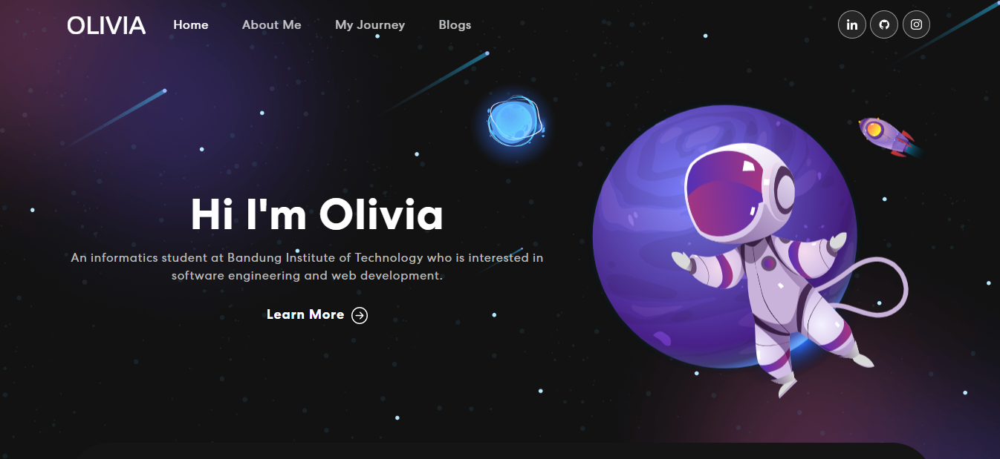
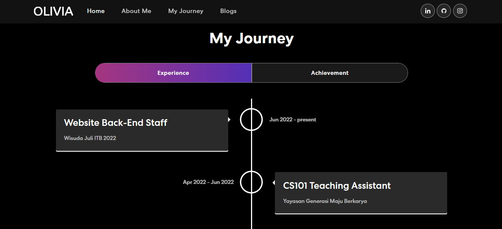
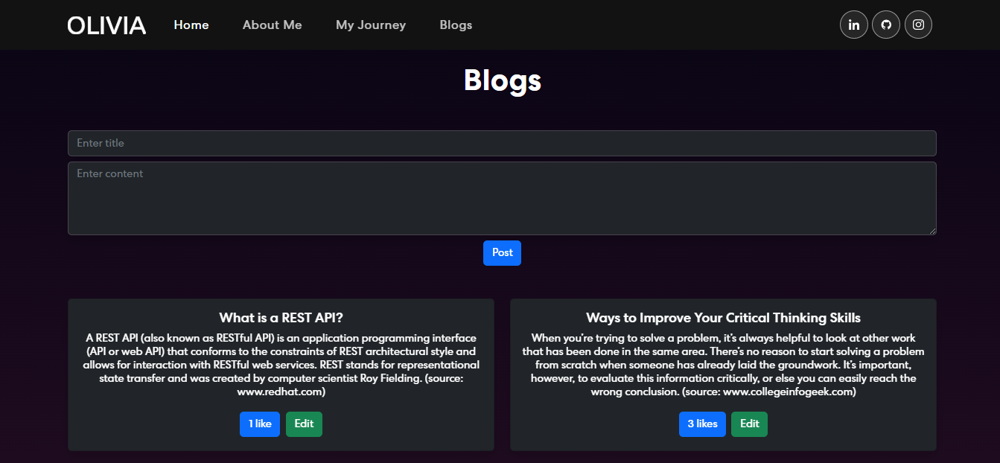
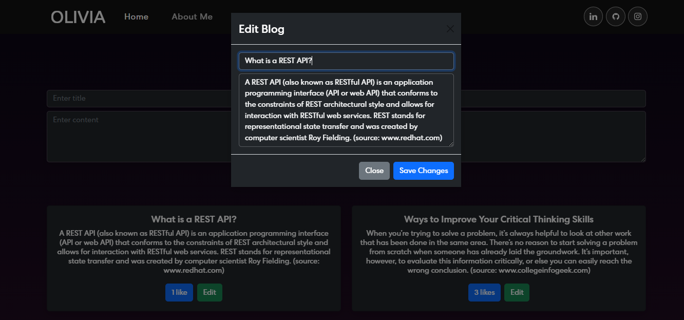

# Margaretha Olivia’s Personal Website

Link Repository : https://github.com/margarethaolivia/ristek-sistech-se-selection

Link Aplikasi : https://margarethaolivia.vercel.app/

Website ini berisi informasi data diri, perjalanan di bidang teknologi dalam bentuk experience dan achievement, serta sistem blog yang memungkinkan pengguna untuk membuat, mengubah, serta melakukan like sebuah postingan blog.

## Fitur pada Sistem Blog

- ### Memposting Blog Baru

  Untuk memposting blog baru, isi input field dengan judul dan konten yang diinginkan. Kemudian klik tombol “Post” untuk memposting blog tersebut.

- ### Menampilkan Seluruh Blog

  Kumpulan semua blog yang pernah ditulis sebelumnya (termasuk blog yang baru saja diposting) terlihat di bagian bawah form.

- ### Mengubah Blog

  Klik tombol “Edit” pada blog yang ingin diubah. Kemudian akan muncul input field yang telah berisi judul dan konten dari blog tersebut yang dapat diubah. Setelah selesai, klik tombol “Save Changes” dan blog akan diperbaharui.

- ### Sistem Like pada Postingan Blog
  Untuk melakukan like pada suatu blog, klik tombol yang berisikan jumlah like pada postingan blog tersebut. Jika berhasil, warna tombol tersebut akan berubah. Satu pengguna hanya dapat melakukan satu like pada setiap postingan blog.

## Beberapa Screenshot Tampilan Website

